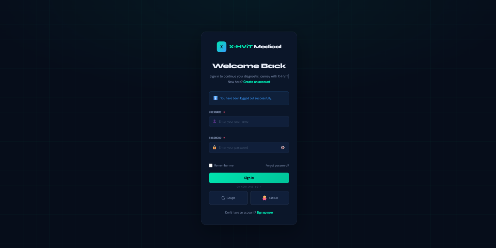
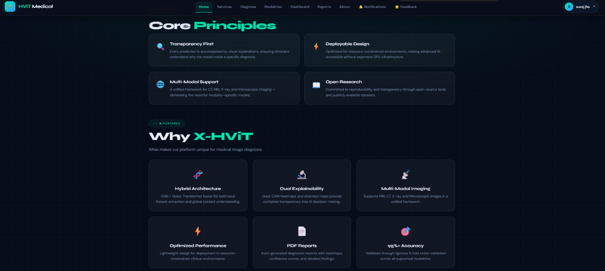
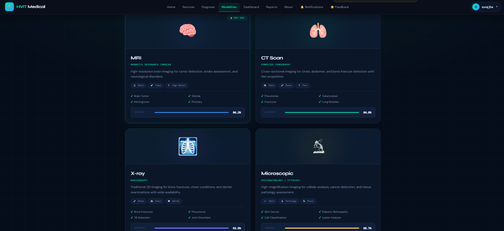
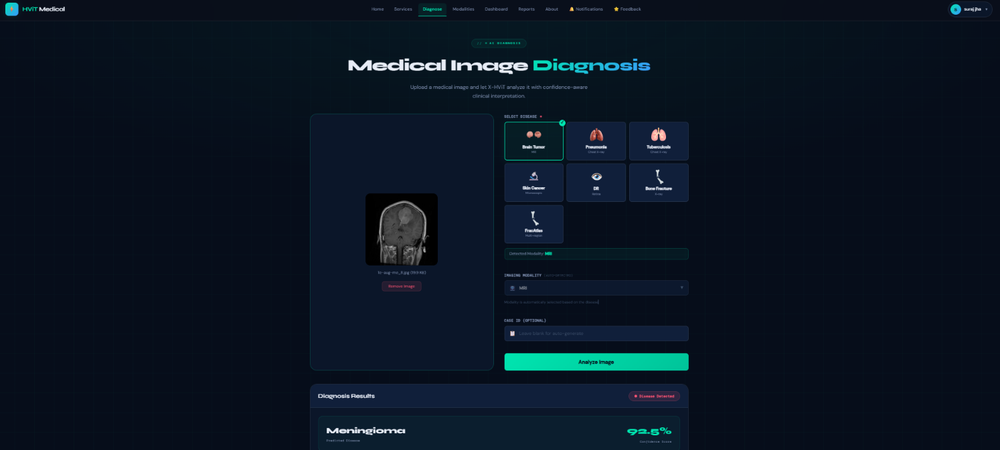
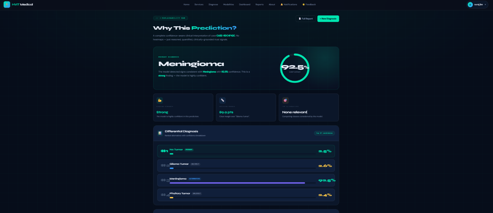
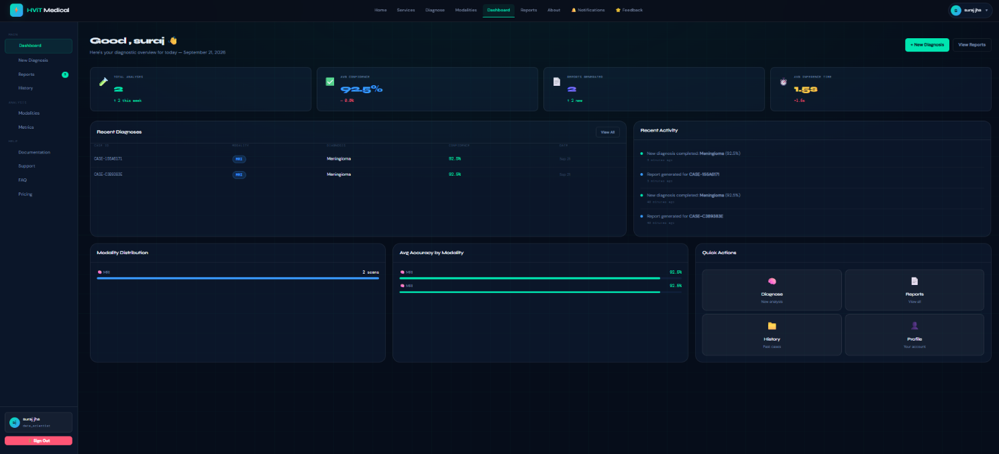
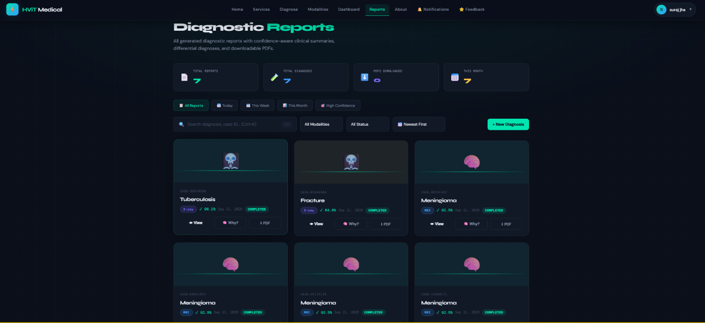
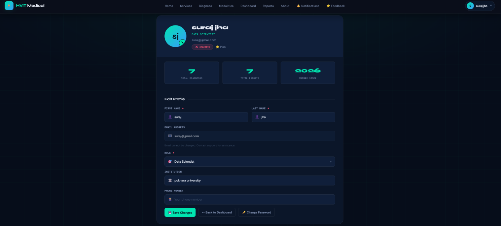
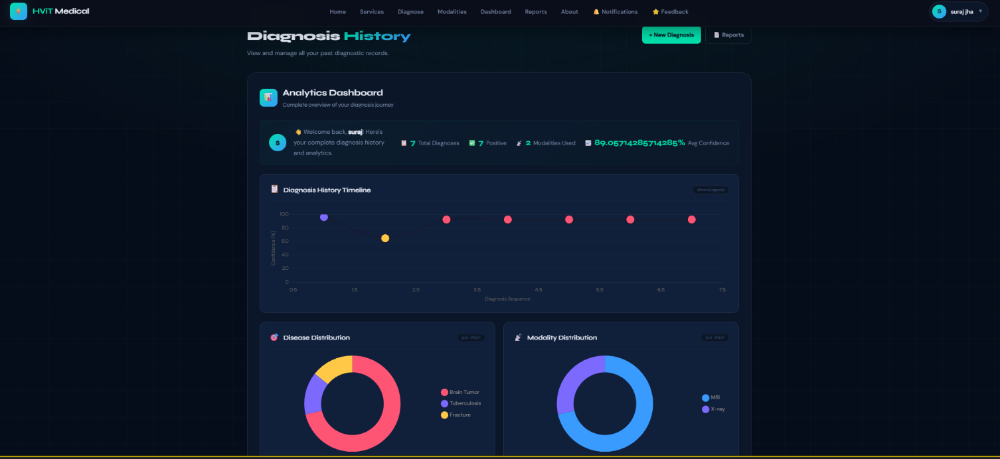

# 🧠 HViT Medical Imaging Diagnosis

### Hybrid Vision Transformer with Confidence-Aware Clinical Interpretation

<p align="center">
  <strong>An explainable deep learning system for multi-dataset medical image classification and structured clinical interpretation.</strong>
</p>

<p align="center">
  <a href="https://github.com/Aayushspk37/FinalProject">
    
  </a>
  
  
  
  
</p>

<p align="center">
  
  
  
  
</p>

---

## 📌 Overview

**HViT Medical Imaging Diagnosis** is an explainable medical imaging system built around a **Hybrid Vision Transformer (HViT)** architecture.

The system combines:

- **CNN-based local feature extraction**
- **Vision Transformer-based global contextual learning**
- **Multi-class and binary medical image classification**
- **Confidence-Aware Clinical Interpretation (CACI)**
- **Structured prediction explanations**
- **LLM-generated clinical interpretation**
- **Django-based web interface**

Rather than returning only a predicted disease class, the system produces a structured interpretation containing **prediction confidence, ranked differential diagnosis, decision margin, severity band, and an LLM-generated clinical narrative**.


---

# ✨ Key Highlights

| Capability | Description |
|---|---|
| 🧠 **Hybrid ViT** | Combines CNN local feature extraction with Transformer global context modeling |
| 🔬 **Multi-Dataset Learning** | Evaluated across seven medical imaging datasets |
| 🩻 **Multi-Modal Imaging** | Supports MRI, X-ray, CT and microscopic/dermoscopic image sources |
| 🎯 **Disease Classification** | Supports both binary and multi-class classification tasks |
| 📊 **CACI Layer** | Converts raw model predictions into structured interpretation |
| 💬 **Clinical Narrative** | Generates an LLM-based natural-language interpretation |
| 🔎 **Differential Diagnosis** | Provides ranked alternative predictions |
| 📈 **Decision Margin** | Indicates separation between competing predictions |
| ⚠️ **Severity Band** | Provides structured severity information |
| 🖥️ **Web Application** | Django-based interface for diagnosis and result exploration |
| 📄 **Reports** | Stores and presents detailed prediction reports |
| 📚 **History** | Maintains previous diagnosis records |

---

# 🏗️ System Architecture

```text
                         ┌──────────────────────┐
                         │     Medical Image    │
                         └──────────┬───────────┘
                                    │
                                    ▼
                         ┌──────────────────────┐
                         │  Image Preprocessing │
                         │ Resize / Normalize   │
                         │ Denoise / Augment    │
                         └──────────┬───────────┘
                                    │
                                    ▼
                    ┌──────────────────────────────┐
                    │     CNN Feature Extractor    │
                    │                              │
                    │  Local Features              │
                    │  Texture / Edges             │
                    │  Anatomical Patterns         │
                    └──────────────┬───────────────┘
                                   │
                                   ▼
                    ┌──────────────────────────────┐
                    │     Patch Tokenization        │
                    │      + Projection             │
                    └──────────────┬───────────────┘
                                   │
                                   ▼
                    ┌──────────────────────────────┐
                    │    Transformer Encoder        │
                    │                              │
                    │ Multi-Head Self-Attention    │
                    │ Global Context Modeling      │
                    └──────────────┬───────────────┘
                                   │
                                   ▼
                    ┌──────────────────────────────┐
                    │      Classification Head      │
                    └──────────────┬───────────────┘
                                   │
                                   ▼
                    ┌──────────────────────────────┐
                    │              CACI              │
                    │ Confidence-Aware Clinical     │
                    │ Interpretation Layer          │
                    └──────────────┬───────────────┘
                                   │
             ┌─────────────────────┼─────────────────────┐
             ▼                     ▼                     ▼
      Confidence Band       Differential Diagnosis   Decision Margin
             │                     │                     │
             └─────────────────────┼─────────────────────┘
                                   │
                                   ▼
                           Severity Band
                                   │
                                   ▼
                     LLM Clinical Interpretation
                                   │
                                   ▼
                       ┌──────────────────────┐
                       │  Explainability Hub  │
                       └──────────┬───────────┘
                                  │
                                  ▼
                       ┌──────────────────────┐
                       │  Reports / History   │
                       │     / Dashboard      │
                       └──────────────────────┘
```

The report describes the system as a pipeline from data collection and preprocessing through HViT inference, CACI signal generation and Explainability Hub presentation.

---

# 🧠 Hybrid Vision Transformer

The core model combines the complementary properties of convolutional and Transformer architectures.

### CNN Feature Extraction

The CNN component extracts local visual information such as:

- Edges
- Textures
- Local anatomical structures
- Fine-grained pathological patterns

### Patch Tokenization

The extracted feature representation is converted into patch-level tokens that can be processed by the Transformer.

### Transformer Encoder

The Transformer uses self-attention to model relationships between different image regions and capture global contextual information.

### Classification Head

The final representation is passed to a classification head to generate disease-class predictions.

This combination allows the architecture to model both **local visual patterns** and **global image context**.

---

# 🩺 CACI — Confidence-Aware Clinical Interpretation

One of the main contributions of the project is the **Confidence-Aware Clinical Interpretation (CACI)** layer.

Instead of exposing only the model's final class, CACI organizes the prediction into multiple interpretable signals.

### CACI Output

```text
Prediction
    │
    ├── Confidence Band
    │
    ├── Ranked Differential Diagnosis
    │
    ├── Decision Margin
    │
    ├── Severity Band
    │
    └── LLM Clinical Narrative
```

### 1. Confidence Band

Represents the confidence associated with the predicted class.

### 2. Ranked Differential Diagnosis

Provides alternative classes ranked according to their prediction probabilities.

### 3. Decision Margin

Describes the separation between the selected prediction and competing predictions.

### 4. Severity Band

Provides a structured severity interpretation associated with the predicted condition.

### 5. Clinical Narrative

Generates a natural-language interpretation of the prediction using an LLM.

The report defines these five components as the principal CACI signals presented through the Explainability Hub.

---

# 📊 Datasets

The system was developed and evaluated using **seven publicly available medical imaging datasets** representing multiple diseases and imaging sources. The combined datasets contain **45,594 images**.

| # | Dataset | Modality | Images | Classes |
|---:|---|---|---:|---:|
| 01 | Brain Tumor MRI | MRI | 7,200 | 4 |
| 02 | FracAtlas | X-ray / CT | 4,083 | 2 |
| 03 | TB Chest X-Ray | X-ray / CT | 4,200 | 2 |
| 04 | Pneumonia Chest X-Ray | X-ray / CT | 5,856 | 2 |
| 05 | Diabetic Retinopathy | Microscopic | 3,662 | 5 |
| 06 | Bone Fracture | X-ray / CT | 10,578 | 2 |
| 07 | HAM10000 Skin Cancer | Microscopic | 10,015 | 7 |

### Supported Imaging Sources

```text
MRI
 └── Brain Tumor

X-Ray / CT
 ├── Fracture
 ├── Tuberculosis
 └── Pneumonia

Microscopic / Dermoscopic
 ├── Diabetic Retinopathy
 └── Skin Cancer
```

---

# ⚙️ Image Preprocessing

The preprocessing pipeline standardizes medical images before model inference.

### Processing Steps

```text
Raw Medical Image
       │
       ▼
Image Resizing
       │
       ▼
Normalization
       │
       ▼
Noise Reduction
       │
       ▼
Data Augmentation
       │
       ▼
Model-Ready Image
```

The project uses resizing, normalization, noise reduction/smoothing and augmentation to create standardized inputs for the HViT architecture.

---

# 🏋️ Model Training

The experimental configuration reported in the project is:

| Hyperparameter | Value |
|---|---|
| Loss Function | Categorical Cross-Entropy |
| Optimizer | AdamW |
| Epochs | 40 |
| Batch Size | 32 |
| Learning Strategy | Learning Rate Scheduler |
| Framework | PyTorch |
| Training Environment | Google Colab / Kaggle |

GPU acceleration was used during model development and experimentation.

---

# 📈 Evaluation Results

The models were evaluated using multiple metrics to provide a broader assessment than accuracy alone.

### Metrics

- Accuracy
- Weighted F1-score
- AUC
- Matthews Correlation Coefficient (MCC)
- Cohen's Kappa
- Precision
- Recall
- Per-class F1-score

### Dataset-Level Performance

| Dataset | Accuracy | F1 | AUC | MCC | Kappa |
|---|---:|---:|---:|---:|---:|
| Brain Tumor MRI | **98.7%** | 0.987 | 0.999 | 0.982 | 0.982 |
| FracAtlas | 84.5% | 0.820 | 0.767 | 0.353 | 0.320 |
| TB Chest X-Ray | 97.0% | 0.970 | 0.994 | 0.894 | 0.893 |
| Pneumonia Chest X-Ray | 94.5% | 0.946 | 0.986 | 0.863 | 0.863 |
| Diabetic Retinopathy | 81.3% | 0.813 | 0.964 | 0.719 | 0.719 |
| Bone Fracture | **99.9%** | 0.999 | 1.000 | 0.997 | 0.997 |
| HAM10000 Skin Cancer | 84.4% | 0.850 | 0.967 | 0.719 | 0.716 |

These values are reported in the final evaluation section of the project report.

> **Important:** Performance varies substantially between datasets. The report identifies class imbalance and the complexity of multi-class tasks as important factors affecting performance.

---

# 🔬 Evaluation Approach

The project evaluates each dataset independently because the datasets differ in:

- Number of classes
- Dataset size
- Class distribution
- Imaging modality
- Disease characteristics

Accuracy is therefore considered alongside MCC, Cohen's Kappa, AUC and per-class metrics. This is particularly relevant for imbalanced medical datasets where aggregate accuracy may not fully describe minority-class performance.

---

# 🖥️ Web Application

The trained models are integrated into a Django-based web application.

### Application Flow

```text
┌─────────────┐
│    Login    │
└──────┬──────┘
       ▼
┌─────────────┐
│     Home    │
└──────┬──────┘
       ▼
┌─────────────┐
│  Modalities │
└──────┬──────┘
       ▼
┌─────────────┐
│   Diagnose  │
└──────┬──────┘
       ▼
┌──────────────────┐
│ Explainability   │
│      Hub         │
└────────┬─────────┘
         ▼
┌──────────────────┐
│    Dashboard     │
└────────┬─────────┘
         ▼
┌──────────────────┐
│     Reports      │
└────────┬─────────┘
         ▼
┌──────────────────┐
│     History      │
└──────────────────┘
```

The final system includes Login, Home, Modalities, Diagnose, Explainability Hub, Dashboard, Reports, Full Reports, History and User Profile interfaces.

---

# 📸 Application Screenshots


### 🔐 Login

<p align="center">
  
</p>

---

### 🏠 Home

<p align="center">
  
</p>

---

### 🩻 Modalities

<p align="center">
  
</p>

---

### 🔬 Diagnosis

<p align="center">
  
</p>

---

### 🔎 Explainability Hub

<p align="center">
  
</p>

---

### 📊 Dashboard

<p align="center">
  
</p>

---

### 📄 Reports

<p align="center">
  
</p>

---

### 👤 User Profile

<p align="center">
  
</p>

---

### 🕘 History

<p align="center">
  
</p>

---

# 🛠️ Technology Stack

| Category | Technologies |
|---|---|
| Language | Python |
| Deep Learning | PyTorch |
| Architecture | CNN + Vision Transformer |
| Image Processing | OpenCV, NumPy |
| Backend | Django |
| Frontend | HTML, CSS, JavaScript |
| Explainability | CACI, Explainability Hub |
| Training | Google Colab, Kaggle |
| Version Control | Git / GitHub |

The project's report identifies Python, PyTorch, OpenCV, HTML and CSS as core components of the technology stack.

---

# 📁 Project Structure

```text
Medical_Image/
│
├── manage.py
├── requirements.txt
│
├── Diagnosis/
│   ├── models.py
│   ├── views.py
│   ├── urls.py
│   ├── forms.py
│   └── ...
│
├── templates/
│   ├── login/
│   ├── home/
│   ├── diagnose/
│   ├── explainability/
│   ├── dashboard/
│   ├── reports/
│   ├── history/
│   └── profile/
│
├── static/
│   ├── css/
│   ├── js/
│   └── images/
│
├── models/
│   ├── brain_tumor/
│   ├── bone_fracture/
│   ├── tb/
│   ├── pneumonia/
│   ├── diabetic_retinopathy/
│   ├── skin_cancer/
│   └── fracatlas/
│
├── screenshots/
│   ├── login.png
│   ├── home.png
│   ├── modalities.png
│   ├── diagnose.png
│   ├── explainability-hub.png
│   ├── dashboard.png
│   ├── reports.png
│   └── history.png
│
└── README.md
```

---

# 🚀 Getting Started

## Prerequisites

Make sure the following are installed:

- Python
- Git
- pip
- A compatible PyTorch environment
- CUDA-enabled GPU environment if GPU inference/training is required

## Clone the Repository

```bash
git clone https://github.com/Aayushspk37/FinalProject.git
cd FinalProject
```

## Create a Virtual Environment

### Windows

```bash
python -m venv venv
venv\Scripts\activate
```

### Linux / macOS

```bash
python3 -m venv venv
source venv/bin/activate
```

## Install Dependencies

```bash
pip install -r requirements.txt
```

## Apply Database Migrations

```bash
python manage.py migrate
```

## Run the Development Server

```bash
python manage.py runserver
```

Then open:

```text
http://127.0.0.1:8000/
```

> The exact runtime requirements may vary depending on the model checkpoints and environment used for the project.

---

# 🧪 Research Findings

The project demonstrates several observations across the seven datasets:

### Class Imbalance

Performance varies with class distribution, and minority classes can remain difficult even when aggregate performance is high.

### Binary vs Multi-Class Classification

Binary tasks generally present a simpler classification setting, while multi-class datasets such as diabetic retinopathy and HAM10000 introduce additional classification complexity.

### CACI

The CACI layer provides a structured approach for transforming raw predictions into multiple interpretation signals rather than exposing only a single class label.

### Explainability

The project emphasizes structured interpretability through CACI and identifies validated visual attribution as an area for further development.

These observations are discussed in the project's evaluation and discussion chapters.

---

# 🔮 Future Work

The project identifies several directions for future development:

- ⚖️ Class-weighted loss
- 🎯 Focal loss
- 🔄 Oversampling and SMOTE
- 🧪 K-fold cross-validation
- 👨‍⚕️ Clinician-validated CACI assessment
- 🔎 Validated visual explainability
- 🧠 Grad-CAM++ and attention-based attribution
- 🏥 Additional medical imaging modalities
- 🔀 Multi-task learning
- 📊 Larger and more diverse datasets
- 🧑‍⚕️ Further clinical evaluation

The report specifically identifies clinician validation and validated spatial explainability as important future extensions.

---

# ⚠️ Limitations

This project is an **academic research prototype**.

Current limitations include:

- Lack of K-fold cross-validation.
- Class imbalance in several datasets.
- Reduced performance on some difficult datasets.
- Limited minority-class performance in some experiments.
- CACI has not yet undergone formal clinician validation.
- Further clinical testing is required before real-world deployment.

The project therefore should not be interpreted as a clinically validated diagnostic system.

---

# 📚 Dataset Sources

The project report provides the following dataset sources:

### 1. Bone Fracture Multi-Region X-ray Data

https://www.kaggle.com/datasets/bmadushanirodrigo/fracture-multi-region-x-ray-data/data

### 2. FracAtlas

https://www.kaggle.com/datasets/orvile/fracatlas

### 3. Brain Tumor MRI Dataset

https://www.kaggle.com/datasets/masoudnickparvar/brain-tumor-mri-dataset

### 4. Tuberculosis Chest X-ray Database

https://www.kaggle.com/datasets/tawsifurrahman/tuberculosis-tb-chest-xray-dataset

### 5. Diabetic Retinopathy 224x224 Dataset

https://www.kaggle.com/datasets/sovitrath/diabetic-retinopathy-224x224-2019-data

### 6. Skin Cancer MNIST: HAM10000

https://www.kaggle.com/datasets/kmader/skin-cancer-mnist-ham10000

### 7. Chest X-Ray Images — Pneumonia

https://www.kaggle.com/datasets/paultimothymooney/chest-xray-pneumonia

Dataset links are reproduced from the final project report.

---


**Repository:**  
https://github.com/Aayushspk37/FinalProject


<p align="center">
  <strong>HViT Medical Imaging Diagnosis</strong>
  <br>
  Hybrid Vision Transformer × Confidence-Aware Clinical Interpretation
  <br><br>
  <a href="https://github.com/Aayushspk37/FinalProject">View Repository →</a>
</p>
